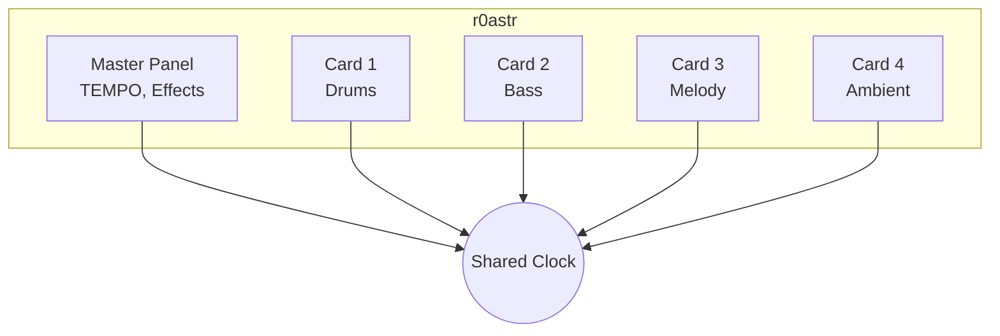

# Story docs-2.1: Concepts Overview

## Status

Done

## Story

**As a** new user,
**I want** to understand r0astr's mental model,
**so that** the interface makes sense before I start coding.

## Acceptance Criteria

1. Explains the "card" concept - independent instruments
2. Explains shared audio clock / synchronization
3. Explains master panel purpose (global controls, tempo)
4. Explains pattern lifecycle (edit → play → live update)
5. Diagram or visual showing cards + master panel relationship
6. Links to detailed guides for each concept

## Tasks / Subtasks

- [ ] Task 1: Write Cards concept section (AC: 1)
  - [ ] Define what a card is
  - [ ] Explain independence (each card = one instrument)
  - [ ] Mention you can have multiple cards
  - [ ] Link to multi-instrument guide

- [ ] Task 2: Write Synchronization section (AC: 2)
  - [ ] Explain shared audio clock
  - [ ] How cards stay in sync
  - [ ] What happens when you start a new card

- [ ] Task 3: Write Master Panel section (AC: 3)
  - [ ] Purpose of master panel
  - [ ] TEMPO control explanation
  - [ ] Global effects/sliders
  - [ ] Link to master panel guide

- [ ] Task 4: Write Pattern Lifecycle section (AC: 4)
  - [ ] Edit pattern in textarea
  - [ ] Click Play to start
  - [ ] Edit while playing for live updates
  - [ ] Click Pause to stop

- [ ] Task 5: Create visual diagram (AC: 5)
  - [ ] ASCII diagram or Mermaid diagram
  - [ ] Show 4 cards + master panel
  - [ ] Show shared clock connection
  - [ ] Save as image if needed

- [ ] Task 6: Add navigation links (AC: 6)
  - [ ] Link to Pattern Syntax
  - [ ] Link to Multi-Instrument Guide
  - [ ] Link to Master Panel Guide

## Dev Notes

### Target File
- `docs-source/learn/concepts.md`

### Current State
Stub exists with basic outline. Needs full content.

### Key Concepts to Convey

1. **Cards = Instruments**: Each card is independent, like having 4 separate instruments
2. **Shared Clock**: All cards share the same tempo/timing
3. **Master Panel**: Global controls that affect everything
4. **Live Coding**: Edit and hear changes immediately

### Diagram Suggestion (Mermaid)

### Testing

- Read through for clarity
- Verify links work
- Check diagram renders

## Change Log

| Date | Version | Description | Author |
|------|---------|-------------|--------|
| 2025-12-13 | 1.0 | Story created | Bob (SM Agent) |

## Dev Agent Record

### Agent Model Used
Claude Opus 4.5 (James - Dev Agent)

### Debug Log References
N/A - Documentation task

### Completion Notes List
- Created comprehensive concepts page with Mermaid diagram
- Explained cards, synchronization, master panel, and pattern lifecycle
- Added visual ASCII flow diagram for pattern lifecycle
- Included quantization explanation
- Added "How They Connect" summary section
- Linked to Pattern Syntax, Multi-Instrument, and Master Panel guides
- Used MkDocs Material grid cards for navigation

### File List
- docs-source/learn/concepts.md (modified)

## QA Results
_To be filled after QA review_
