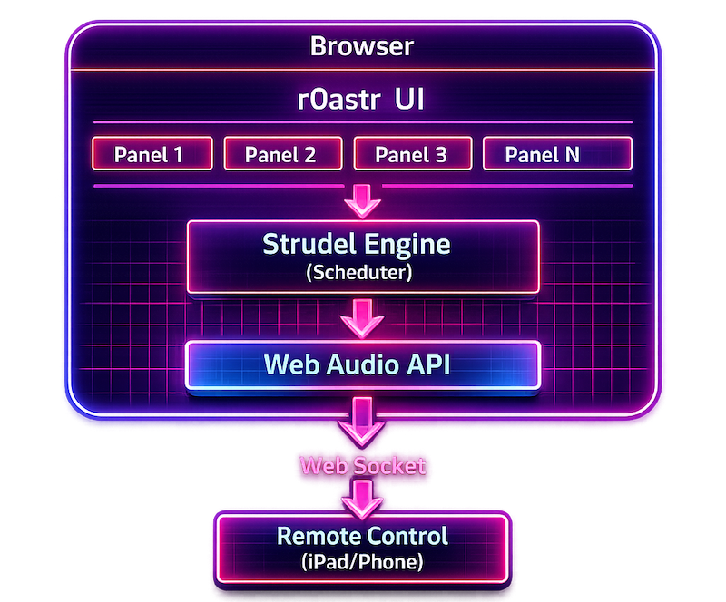

# Architecture Overview

Technical overview of `r0astr`'s system design.

## System Diagram



## Core Components

### UI Layer

- Panel management (create, update, delete — dynamic panel count)
- Pattern editor with CodeMirror
- Slider controls (auto-generated from patterns)
- Master panel for global controls

### Strudel Integration

```javascript
const { evaluate, scheduler } = repl({
  defaultOutput: webaudioOutput,
  getTime: () => ctx.currentTime,
  transpiler,
});
```

Key integration points:

- **repl()** — Creates the pattern evaluation environment
- **evaluate()** — Compiles and runs pattern code
- **scheduler** — Manages pattern timing and synchronization
- **transpiler** — Converts pattern code to executable JavaScript

### Audio Engine

- Single shared `AudioContext` (browser requirement)
- All patterns share the same audio clock
- Web Audio nodes for synthesis and effects

### WebSocket Server

- Runs on the Vite dev server (dev) or Electron main process (production)
- Handles remote control connections
- Broadcasts state changes to all clients

## Key Files

| File | Purpose |
|------|---------|
| `index.html` | Main HTML structure |
| `src/main.js` | Application logic, Strudel initialization |
| `src/state.js` | Shared state (cardStates, editorViews, AudioContext) |
| `src/managers/panelManager.js` | Panel lifecycle and state Map |
| `src/managers/websocketManager.js` | WebSocket client (browser-side) |
| `src/managers/sliderManager.js` | Slider rendering and synchronization |
| `src/managers/settingsManager.js` | localStorage persistence |
| `src/managers/skinManager.js` | UI skin loading and switching |
| `src/panels/panelEditor.js` | CodeMirror integration |
| `src/panels/panelUI.js` | Button state and visual indicators |
| `src/utils/eventBus.js` | Pub/sub event system |
| `src/websocket-server.mjs` | WebSocket server (Node.js side) |
| `vite.config.mjs` | Build config + REST API + WebSocket setup |

## Data Flow

1. User edits pattern in panel
2. Pattern sent to Strudel transpiler
3. Transpiler generates executable code
4. Scheduler evaluates pattern each cycle
5. Audio output sent to Web Audio API
6. State changes broadcast via WebSocket

## Strudel Packages Used

| Package | Purpose |
|---------|---------|
| `@strudel/core` | Pattern engine |
| `@strudel/mini` | Mini notation parser |
| `@strudel/transpiler` | Code transpiler |
| `@strudel/webaudio` | Audio output |
| `@strudel/tonal` | Music theory |
| `@strudel/soundfonts` | SoundFont support |
| `@strudel/codemirror` | Editor integration |

## Build Pipeline

```
Source Files
     │
     ▼
Vite Development Server ──► Hot Module Replacement
     │
     ▼
Vite Build
     │
     ├──► dist/          (Electron app)
     │
     └──► dist-lite/     (Web-only, no server)
              │
              ▼
         GitHub Pages
```
