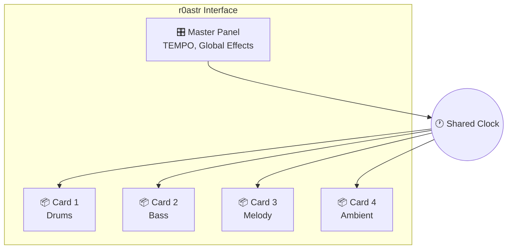

# Concepts

Understand the mental model behind r0astr to make the interface intuitive.

---

## The Big Picture

r0astr is a multi-instrument live coding environment. Think of it as having four independent instruments on stage, all connected to the same metronome. You write code to control each instrument, and they all play together in perfect sync.



---

## Cards

Each **card** is an independent instrument in r0astr.

### What is a Card?

A card is a self-contained unit that includes:

- A **code editor** where you write patterns
- A **Play/Pause button** to control playback
- **Slider controls** for real-time parameter adjustments

### Independence

Cards operate independently:

- **Different patterns**: Each card can play completely different music
- **Separate controls**: Start, stop, and modify each card without affecting others
- **Own parameters**: Each card can have its own sliders and settings

### Typical Setup

Most compositions use cards for different roles:

| Card | Common Use |
|------|------------|
| Card 1 | Drums and percussion |
| Card 2 | Bass line |
| Card 3 | Melody or lead |
| Card 4 | Ambient or effects |

This is just a suggestion - use cards however you like!

[:octicons-arrow-right-24: Learn more in the Multi-Instrument Guide](multi-instrument.md)

---

## Synchronization

All cards share a **single audio clock**. This is the key to how r0astr works.

### Shared Clock

- Every card receives timing from the same master clock
- When you start a new card, it automatically syncs with already-playing patterns
- No drift or timing issues between instruments

### What This Means in Practice

1. **Start Card 1** with a drum pattern
2. **Start Card 2** with a bass line - it immediately locks to the beat
3. **Start Card 3** with a melody - also perfectly in sync
4. All three play together as if they were designed as one piece

### Quantization

When you press Play on a card:

- The pattern doesn't start immediately at a random point
- It waits for the next cycle boundary
- This ensures musical timing is always correct

---

## Master Panel

The **master panel** sits above all cards and provides global controls.

### Purpose

The master panel affects **everything at once**:

- **TEMPO**: Set the speed (in CPS - cycles per second)
- **Global Sliders**: Create variables like `SLIDER_LPF` that all cards can use
- **Master Effects**: Apply filters or effects to the entire mix

### TEMPO Control

The master panel is where you set the global tempo using a slider:

```javascript
// In Master Panel
let TEMPO = slider(30, 15, 45);  // 30 CPS, range 15-45
```

All cards automatically follow this tempo.

### Global Sliders

Define sliders in the master panel that any card can reference:

```javascript
// Master Panel
let SLIDER_LPF = slider(800, 100, 5000);

// Card 1 (or any card) can use it:
s("bd*4").lpf(SLIDER_LPF)
```

This lets you control parameters across all instruments with a single slider.

[:octicons-arrow-right-24: Learn more in the Master Panel Guide](master-panel.md)

---

## Pattern Lifecycle

Understanding how patterns work as you edit and play them.

### The Flow

```
┌─────────┐     ┌─────────┐     ┌──────────────┐
│  Write  │ --> │  Play   │ --> │ Live Update  │
│ Pattern │     │         │     │  (optional)  │
└─────────┘     └─────────┘     └──────────────┘
                     │                  │
                     v                  v
                ┌─────────┐     ┌─────────┐
                │  Hear   │     │ Changes │
                │  Sound  │     │ Applied │
                └─────────┘     └─────────┘
```

### Step by Step

1. **Write**: Type or paste a pattern into a card's text area
2. **Play**: Click the Play button to start the pattern
3. **Listen**: Audio plays immediately through your speakers
4. **Edit (optional)**: Modify the pattern while it's playing
5. **Update**: Changes take effect on the next cycle
6. **Pause**: Click Pause to stop only that card

### Live Coding

The magic of r0astr is **live coding**:

- Edit patterns while they play
- Hear changes almost instantly
- No need to stop and restart
- Experiment in real-time

!!! tip "Pro Tip"
    Make small changes and listen. This is the essence of live coding - evolving your music incrementally as you play.

---

## How They Connect

Let's tie all the concepts together:

1. **You write patterns** in each card using Strudel's mini notation
2. **Cards are independent** - each runs its own pattern
3. **The master panel** provides global controls like TEMPO
4. **A shared clock** keeps everything synchronized
5. **Live updates** let you evolve your music in real-time

---

## Next Steps

<div class="grid cards" markdown>

-   :material-music-note:{ .lg .middle } **Pattern Syntax**

    ---

    Learn the mini notation language for writing patterns.

    [:octicons-arrow-right-24: Pattern Syntax](patterns.md)

-   :material-view-grid:{ .lg .middle } **Multi-Instrument**

    ---

    Advanced techniques for using multiple cards together.

    [:octicons-arrow-right-24: Multi-Instrument Guide](multi-instrument.md)

-   :material-tune:{ .lg .middle } **Master Panel**

    ---

    Deep dive into global controls and sliders.

    [:octicons-arrow-right-24: Master Panel Guide](master-panel.md)

</div>
